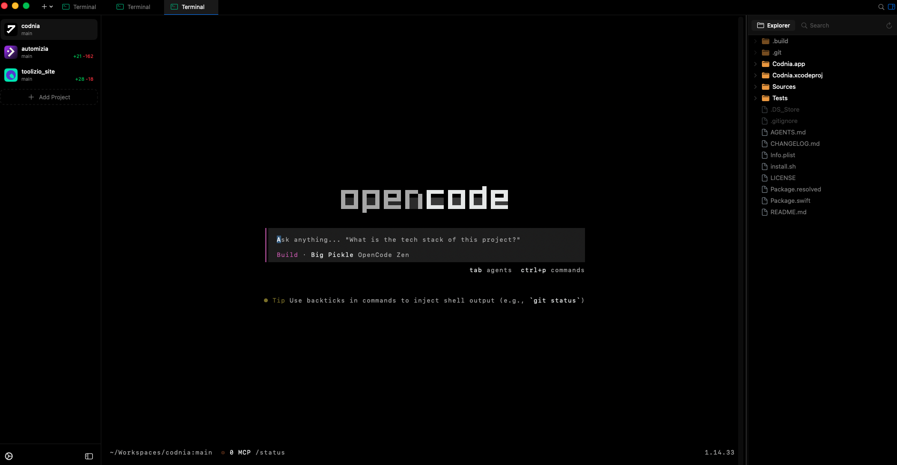

# Codnia

A modern, lightweight desktop IDE built with Swift and SwiftUI for macOS.




## Features

### Editor
- **Native NSTextView** editor with dark theme
- File model caching, Save / Save As, modified indicators
- Configurable font size

### Terminal
- **SwiftTerm** native terminal with real shell spawning
- Multiple terminal instances in separate tabs
- Custom shell and command execution support

### AI Agent Integration
- Built-in terminal tabs for **OpenCode**, **Claude Code**, and **Codex**
- One-click launch from the New Tab dropdown

### Search
- Global search with regex and case-sensitive toggles
- File name and content search with match highlighting
- Smart directory exclusion (node_modules, .git, target, dist, etc.)

### Workspace
- Multi-root workspace support
- Project sidebar with Git branch display
- Per-project tab state (editor + terminal tabs restored on switch)
- Recent projects list

### File Explorer
- Recursive tree view with lazy-loading
- Full CRUD: create, rename, delete, duplicate, copy, cut, paste
- Drag-and-drop support
- Inline rename and creation (F2, context menu)

### Preview
- Markdown rendering (GFM: tables, footnotes, task lists, strikethrough)
- HTML passthrough preview
- Auto-detect from file extension

### Settings
- Separate settings window with multiple tabs
- Rebindable keyboard shortcuts with recording input
- Persistent settings with cross-window sync

### Keyboard Shortcuts
| Shortcut | Action |
|----------|--------|
| `Cmd+N` | New File |
| `Cmd+O` | Open File |
| `Cmd+S` | Save |
| `Cmd+Shift+S` | Save As |
| `Cmd+W` | Close Tab |
| `Cmd+B` | Toggle Sidebar |
| `` Cmd+` `` | Toggle Terminal |
| `Cmd+Shift+F` | Global Search |
| `Cmd+Shift+O` | Run OpenCode |
| `Cmd+Shift+C` | Run Claude Code |
| `Cmd+Shift+X` | Run Codex |
| `Cmd+,` | Open Settings |

## Tech Stack

| Layer | Technology |
|-------|-----------|
| Desktop framework | **SwiftUI** (macOS 13+) |
| Language | **Swift 5.9+** |
| Code editor | **NSTextView** (native) |
| Terminal | **SwiftTerm** |
| Build | **Swift Package Manager** |

## Getting Started

### Prerequisites

- [Xcode](https://developer.apple.com/xcode/) (15+)
- macOS 13 (Ventura) or later

### Development

```bash
# Build the project
swift build

# Run in development mode
swift run
```

### Build

```bash
# Release build
swift build --configuration release
```

Build output: `.build/release/Codnia`

### Project Structure

```
codnia/
├── Sources/
│   └── Codnia/
│       ├── CodniaApp.swift    # App entry point and configuration
│       ├── Views/             # SwiftUI views
│       ├── ViewModels/       # ObservableObject classes
│       ├── Services/         # Business logic services
│       ├── Models/           # Data models
│       ├── Components/       # Reusable UI components
│       ├── Extensions/       # Swift extensions
│       └── Resources/        # App resources
├── Package.swift             # Swift Package Manager config
└── README.md
```

## Contributing

Contributions are welcome! Please follow this process:

1. **Create an Issue** - Report bugs, errors, or suggest new features.
2. **Issue Approval** - The issue will be reviewed and approved for development.
3. **Development** - Develop the fix/feature in a dedicated branch.
4. **Pull Request** - Submit your changes to the `main` branch.
5. **PR Approval** - The pull request will be reviewed and approved.
6. **Release** - Once approved, the changes will be included in the next version.

> **Note for maintainers:** When cutting a new release, always update the version badge in this README and keep the changelog in `CHANGELOG.md` up to date.

## License

This project is licensed under the [MIT License](LICENSE).